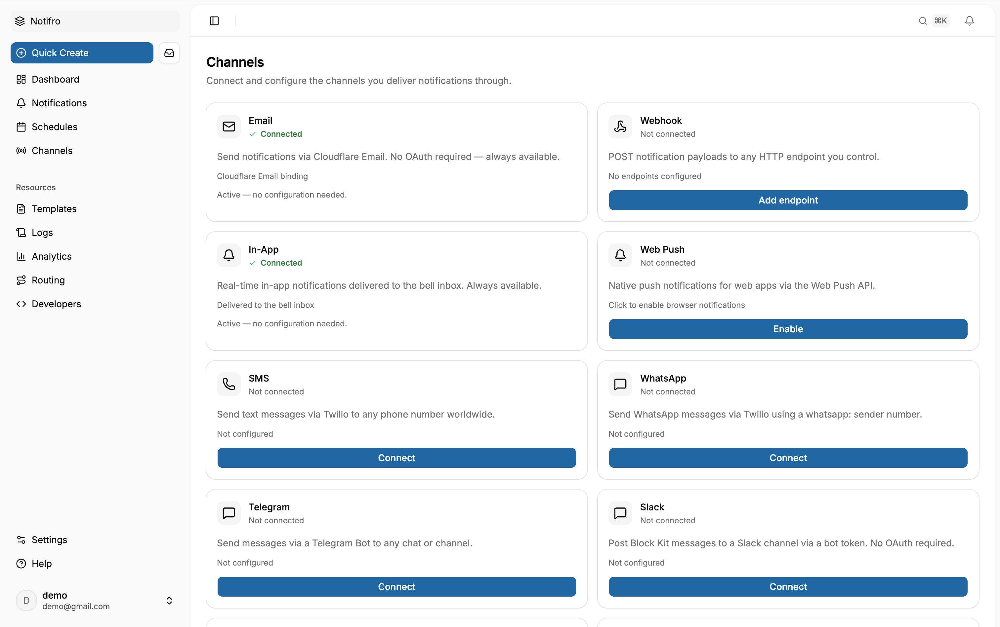

# Renderical

**Unified notification infrastructure — compose once, deliver everywhere.**

Renderical normalizes ten channels behind a single compose-once API. Write a message once and
Renderical transforms and delivers it across Slack, email, Microsoft Teams, Discord, WhatsApp,
Telegram, web push, webhooks, in-app inbox, and SMS — with routing rules, fallback chains,
provider failover, scheduling, rate limiting, and a **native MCP server** so AI agents can send
safely. It runs entirely on Cloudflare's edge and is fully self-hostable.

<h1 align="center">
   <picture>
   <source media="(prefers-color-scheme: dark)" srcset="apps/site/public/bg-dark.png">
   
   </picture>
</h1>

## Features

- **Compose-once API** — one normalized payload, transformed per channel (Slack Block Kit,
  HTML email, Teams adaptive cards, Discord embeds, web push, …). Content blocks plus a
  template engine with variables, conditionals, loops, and i18n.
- **10 channels** — Slack, email (SMTP/SendGrid/Resend), Teams, Discord, WhatsApp, Telegram,
  web push (VAPID), webhooks (HMAC-signed), SMS (Twilio), and an in-app inbox.
- **Routing & fallback** — priority-ordered routing rules, ordered fallback chains, and
  per-channel provider failover, with dry-run route resolution.
- **Scheduling** — send-at with timezone awareness, recurring (cron) sends, quiet hours,
  delivery windows, and per-channel rate limiting — driven by a cron-trigger sweep.
- **Reliability** — a Cloudflare Queue with exponential-backoff retries, a dead-letter queue,
  idempotency keys, PII redaction, delivery events (delivered/opened/clicked/bounced), open &
  click tracking, and inbound provider receipts.
- **Templates & content** — template editor, version history with restore, and a brand kit.
- **Analytics** — delivery stats by channel, status, and date; top topics; and an overview
  dashboard, backed by a full API request log.
- **Auth & keys** — better-auth with email + password, email OTP, Google OAuth, 2FA
  (TOTP / email OTP / backup codes), phone verification (Twilio), and scoped `rk_` API keys.
- **Native MCP server** — agents send, schedule, preview, template, and query analytics within
  granted scopes, behind approval gates and rate limits.

## MCP server

Renderical exposes the platform at `POST /mcp` (authenticated with an `rk_` API key), available
hosted (Streamable HTTP) and local (stdio via `@renderical/mcp`).

- **Tools** — `send_notification`, `schedule_notification`, `list_channels`,
  `get_delivery_status`, `create_template`, `render_preview`, `query_analytics`, `approve_action`.
- **Resources** — `renderical://channels`, `renderical://templates`, `renderical://recent-deliveries`.
- **Safety** — per-tool approval gates, key-scoped access, KV rate limiting, idempotency, and
  every call written to the request log.

## Tech stack

Cloudflare Workers · Hono · React 19 · better-auth · Kysely · D1 · Queues · KV · Cloudflare
Email · `@hono/zod-openapi` + Scalar. Tooling: pnpm workspaces + Turborepo.

## Monorepo layout

```
apps/
  api       → Cloudflare Worker — all backend logic (compose, queue, cron, MCP, auth)
  web       → React 19 SPA dashboard
  site      → Astro marketing site
  desktop   → Electron (Forge) wrapper
  ios       → Capacitor iOS wrapper
  android   → Capacitor Android wrapper
packages/
  core         → feature-level UI components & TanStack Query hooks
  views        → page components & platform routers
  app          → cross-platform auth + app context
  api-client   → typed HTTP client
  sdk          → public TypeScript SDK
  cli          → `renderical` CLI
  mcp          → MCP server package
  mailer       → transactional email templates
  templating   → Mustache-style template engine
  ui           → shadcn UI primitives
  ui-primitives→ theme provider
  i18n         → internationalisation stubs
```

## Development

```bash
pnpm install
pnpm --filter api db:migrate   # apply migrations to a local D1
pnpm dev                       # turbo dev: api (:8787) + web (:5173) + site (:4321)
pnpm build                     # turbo build
pnpm lint
pnpm typecheck
```

## Self-hosting

Renderical deploys to your own Cloudflare account: a D1 database, two KV namespaces, a delivery
queue + dead-letter queue, the Email send binding, and an every-minute cron trigger. In short:

```bash
cd apps/api
npx wrangler d1 create renderical
npx wrangler kv namespace create renderical-auth
npx wrangler kv namespace create renderical-rate-limit
npx wrangler queues create delivery-queue
npx wrangler queues create delivery-dlq
# paste the ids into apps/api/wrangler.jsonc, then set secrets:
npx wrangler secret put CONNECTION_ENC_KEY   # + FRONTEND_URL, GOOGLE_*, TWILIO_*, VAPID_PUBLIC_KEY
pnpm --filter api db:migrate:remote
pnpm --filter api deploy
```

Point the web app at your API (`VITE_API_URL`) and deploy `apps/web` (and optionally `apps/site`)
to Cloudflare Pages. The full walkthrough lives on the marketing site's **Self-host** page.
